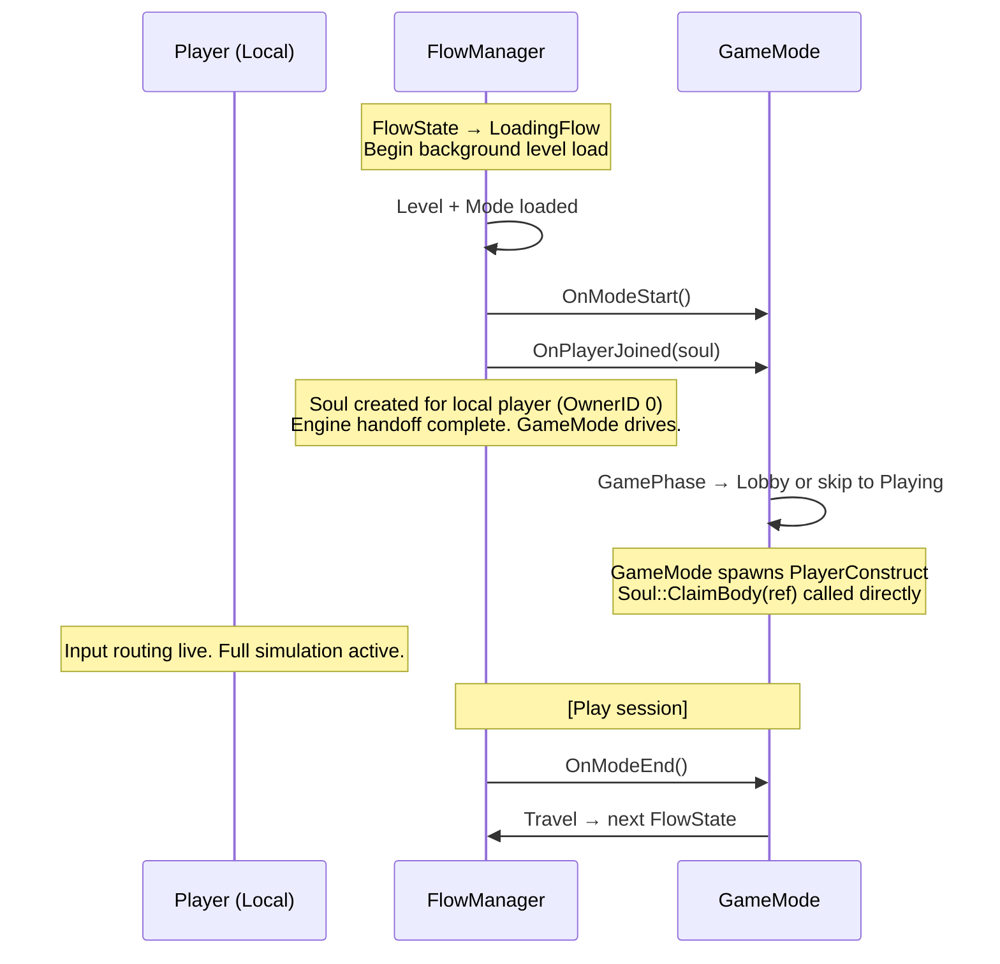
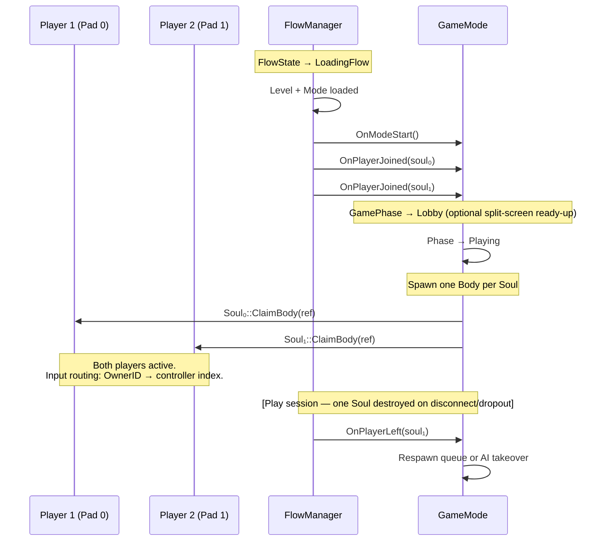

# Game Flow — TrinyxEngine

Describes the lifecycle of sessions from startup through active play, and the engine/gameplay
responsibility boundary. Covers multiplayer (online), singleplayer, and local co-op. The
FlowState machine and GameMode API are identical across all three — the network layer is an
additive concern, not a structural one.

---

## Principle

The engine owns **transport and entity lifecycle**. Gameplay owns **everything after handshake**.
The handoff happens at `GameMode::OnPlayerJoined(soul)`. From that point the engine is a substrate
the GameMode calls into — it does not orchestrate game protocol.

---

## Terminology

| Term                   | Definition                                                                                                                                                                                                                                                                                              |
|------------------------|---------------------------------------------------------------------------------------------------------------------------------------------------------------------------------------------------------------------------------------------------------------------------------------------------------|
| **FlowState**          | Structural application state — owns World/Level/NetSession lifetime. `MenuFlow`, `LoadingFlow`, `GameplayFlow`. Managed by `FlowManager`.                                                                                                                                                               |
| **GameMode**           | Rules runtime. Owns match logic, phases, and player lifecycle after handshake. One per World.                                                                                                                                                                                                           |
| **GamePhase**          | Substate inside a GameMode (`Lobby`, `Warmup`, `Playing`, `PostRound`). Engine-invisible — GameMode runs its own phase machine.                                                                                                                                                                         |
| **Soul**               | Session-scoped identity for a connected player. Created at `OnPlayerJoined`, destroyed at `OnPlayerLeft`. Holds `ConfirmedBodyHandle` once spawned.                                                                                                                                                     |
| **Body**               | The authoritative Construct representing a player's in-world presence. Always server-created. Client claims it via `Soul::ClaimBody`.                                                                                                                                                                   |
| **GameModeManifest**   | Server→Client context publish. Gives the client everything it needs to prepare: mode name, level, rules, provisional assignments, or any game-defined payload. Drives loading screen UI, asset preloading, etc. Can be sent multiple times; each send is an implicit invitation for a Preference reply. |
| **ClientModeManifest** | Client→Server optional reply to a `GameModeManifest`. Carries whatever the GameMode cares about: team/class hints, cosmetic choices, loadout, modifiers, MMR tags. Keyed to the Manifest sequence number that prompted it. Engine defines the envelope; content is game-defined.                        |

---

## Session Flowchart

```mermaid
sequenceDiagram
    participant C as Client
    participant E as Engine (Server)
    participant GM as GameMode

    C->>E: Connect (GNS)
    E->>C: HandshakeAccept (OwnerID, ServerFrame, TickRate)
    C->>E: ClockSync request
    E->>C: ClockSync response (RTT → InputLead computed)

    E->>C: TravelNotify (levelPath, modeName, serverFrame)
    Note over C: FlowState → LoadingFlow<br/>Begin background level load

    C->>E: LevelReady (+ optional game payload)
    Note over E: RepState: LevelLoaded<br/>Flush Alive entities to client
    E->>C: EntitySpawn* (Alive flag, background entities)
    E->>C: FlowEvent::ServerReady
    Note over C: Alive → Active sweep<br/>World is live

    E->>GM: OnPlayerJoined(soul)
    Note over E: Engine handoff complete.<br/>GameMode drives from here.

    GM->>C: GameModeManifest (mode, level, rules, optional provisional data)
    Note over C: Load assets, populate loading screen<br/>Parse manifest payload
    C->>GM: ClientModeManifest (optional — preferences, customizations, modifiers)
    GM->>GM: Consume preferences; may resend Manifest (invites new Preference)

    Note over GM: [Lobby: timer / all-ready]
    GM->>GM: Phase → Playing

    Note over GM: Server spawns PlayerConstruct authoritatively
    GM->>C: SpawnConfirm (ConstructNetHandle, EntityNetHandle, authPos)
    Note over C: Soul::OnBodyConfirmed(ref)<br/>Wire replication, input routing<br/>Send cosmetics/loadout RPC

    Note over C,GM: Full simulation sync active
```

---

## Engine / GameMode Boundary

```
Engine owns                          GameMode owns
───────────────────────────────      ──────────────────────────────────
HandshakeAccept                      GameModeManifest
ClockSync                            ClientModeManifest
TravelNotify                         ReadyUp / lobby countdown
LevelReady (structural ack)          LevelReady game payload
Entity replication (Alive/Active)    Spawn timing decision
OnPlayerJoined(soul) ──────────────► Everything after this line
OnPlayerLeft(soul)                   Cleanup, respawn, grace period
Soul::ClaimBody primitive            When and with what to call it
Disconnect detection                 Reconnect grace period policy
```

---

## ModeMixin System

GameModes compose opt-in CRTP mixins for common feature sets. The engine defines a vocabulary;
game code opts in or overrides. No mixin required = no cost.

```cpp
class ArenaMode : public GameMode
               , public WithSpawnManagement<ArenaMode>
               , public WithTeamAssignment<ArenaMode>
               , public WithLobby<ArenaMode>
{
    ConstructRef GetCharacterPrefab(const Soul& soul) override;
    void OnTeamAssigned(Soul& soul, uint8_t team) override;
    // ScalarUpdate(dt) — opt into Construct tick for win condition
};
```

### Message Type ID Allocation

Each mixin claims a contiguous band of message type IDs at static-init time.

| Band      | Owner                                                                                                 |
|-----------|-------------------------------------------------------------------------------------------------------|
| 0 – 15    | Engine core (Handshake, ClockSync, TravelNotify, LevelReady, FlowEvent, EntitySpawn, StateCorrection) |
| 16 – 127  | Engine-defined mixins (fixed IDs, never change)                                                       |
| 128 – 255 | User-defined mixins (`TNX_REGISTER_MODEMIX`)                                                          |

**Engine mixin IDs** are compile-time constants. `WithSpawnManagement` always claims 16–19,
`WithTeamAssignment` always 20–23, etc. Wire-compatible between any two games using the same engine.

**User mixin registration:**

```cpp
TNX_REGISTER_MODEMIX(MyAbilityMixin)
// Static init assigns next available ID from 128 upward.
// MyAbilityMixin::GetBaseMessageTypeID() returns the assigned value.
```

**Engine defines the envelope** (message type ID, length-prefixed payload, Manifest sequence number so
Preference replies are keyed to the correct Manifest). **Content is entirely game-defined** — the
engine does not interpret the payload. A simple game puts nothing in ClientModeManifest. A complex one
packs loadout hashes, regional matchmaking tags, and cosmetic IDs.

Registration bakes into `MixinRegistry` alongside entity, construct, and component registrations.
If two user mixins would collide (both registered at 128), the registry asserts at startup.

### Engine-defined Mixin Surface

| Mixin                    | IDs   | Override points                                           |
|--------------------------|-------|-----------------------------------------------------------|
| `WithSpawnManagement<T>` | 16–19 | `GetCharacterPrefab`, `ValidateSpawn`, `OnSpawnConfirmed` |
| `WithTeamAssignment<T>`  | 20–23 | `AssignTeam`, `OnPreferenceReceived`                      |
| `WithLobby<T>`           | 24–27 | `OnAllReady`, `GetCountdownDuration`                      |
| `WithRespawn<T>`         | 28–31 | `GetRespawnDelay`, `OnRespawnReady`                       |
| `WithSpectator<T>`       | 32–35 | `CanSpectate`, `OnSpectatorJoined`                        |

---

## Soul Lifecycle

```
OnPlayerJoined(soul)
    │
    ├─ engine: Soul created, OwnerID assigned
    │
    ├─ game: GameModeManifest sent
    │         ClientModeManifest received, stored on Soul
    │
    ├─ game: Phase → Playing, server spawns Body
    │         Soul::ClaimBody(ConstructRef) called by GameMode
    │         Soul::OnBodyConfirmed() fires on client
    │
    └─ Soul.ConfirmedBodyHandle valid — input routing live

OnPlayerLeft(soul)
    │
    ├─ game: GameMode::OnPlayerLeft — cleanup, respawn queue, etc.
    └─ engine: Soul destroyed, ConstructRef released
```

**Soul does not hold wire tokens.** `PredictionLedger` lives in `ConnectionInfo`
(transport layer). Soul holds only the confirmed result: `ConfirmedBodyHandle : ConstructRef`.

---

## PredictionLedger

Owned by `ConnectionInfo` — transport-scoped, client-side only.

```
PredictionID → (LocalEntityHandle, RequestFrame, PrefabID)
```

Single-entry today (one body in flight at a time). Same structure scales to projectile/ability
prediction by changing the table capacity. Server always echoes `PredictionID` in Confirm/Reject.
On Confirm: promote local entity to authoritative, fire `OnBodyConfirmed`. On Reject: destroy
predicted entity, clear ledger entry.

---

## Singleplayer / Local Co-op Flow

The engine/gameplay boundary is **identical** to the multiplayer case — GameMode API, Soul lifecycle,
FlowState transitions, and ModeMixin composition all work without change. The network layer is simply
absent. FlowManager transitions states locally; Souls are created by FlowManager directly rather than
triggered by a network handshake.

### Singleplayer



**What's absent:** `HandshakeAccept`, `ClockSync`, `TravelNotify`, `RepState` machine, `PredictionLedger`,
`NetChannel`. `TravelNotify` is replaced by a local `FlowManager::Travel(...)` call — same state
machine, no wire message.

**What stays:** FlowState transitions, GameMode lifecycle, GamePhase machine, Soul, `WithLobby` (can
drive a local start screen), `WithRespawn`, `WithTeamAssignment` (player vs. AI team splits), all
ModeMixins. Game code written for singleplayer compiles and runs online without changes.

---

### Local Co-op

Extends singleplayer with multiple local Souls — one per connected controller. OwnerIDs are assigned
locally by `FlowManager`. No network layer.



**Soul identity in local co-op:** `InputLead` stores a controller index (0–3) instead of a network
`OwnerID`. `FlowManager` maps local gamepad connect/disconnect events to `OnPlayerJoined` /
`OnPlayerLeft` the same way the server-side path maps network connect/disconnect.

**Split-screen viewport assignment** is a FlowState concern (how the camera divides the screen), not a
GameMode concern. GameMode only sees Souls and Bodies.

---

### Mode Comparison

|                       | Singleplayer | Local Co-op  | Online Multiplayer |
|-----------------------|--------------|--------------|--------------------|
| FlowState machine     | ✅ same       | ✅ same       | ✅ same             |
| GameMode API          | ✅ same       | ✅ same       | ✅ same             |
| Soul lifecycle        | ✅ (local)    | ✅ (per pad)  | ✅ (per connection) |
| GamePhase machine     | ✅ same       | ✅ same       | ✅ same             |
| ModeMixins            | ✅ all work   | ✅ all work   | ✅ all work         |
| NetChannel            | ❌ absent     | ❌ absent     | ✅                  |
| PredictionLedger      | ❌ absent     | ❌ absent     | ✅                  |
| TravelNotify wire msg | ❌ local call | ❌ local call | ✅                  |
| RepState machine      | ❌ absent     | ❌ absent     | ✅                  |
| InputLead meaning     | controller 0 | controller N | network OwnerID    |

---

## Status

| Feature                                            | State         |
|----------------------------------------------------|---------------|
| HandshakeAccept + ClockSync                        | ✅ Implemented |
| TravelNotify + LevelReady + RepState machine       | ✅ Implemented |
| FlowEvent::ServerReady + Alive→Active sweep        | ✅ Implemented |
| Soul + FlowManager lifecycle                       | ✅ Implemented |
| NetChannel typed send wrapper                      | ✅ Implemented |
| GameState → FlowState rename                       | ✅ Implemented |
| GameModeManifest message                           | 🔲 Pending    |
| ClientModeManifest wire struct                     | 🔲 Pending    |
| ModeMixin registry + TNX_REGISTER_MODEMIX          | 🔲 Pending    |
| WithSpawnManagement mixin                          | 🔲 Pending    |
| WithTeamAssignment mixin                           | 🔲 Pending    |
| WithLobby mixin                                    | 🔲 Pending    |
| Soul::ClaimBody + OnBodyConfirmed                  | 🔲 Pending    |
| PredictionLedger in ConnectionInfo                 | 🔲 Pending    |
| StateCorrection frame-awareness + rollback trigger | 🔲 Pending    |
